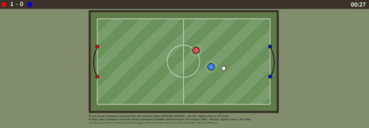

# OpenHax — Local 2-Player Haxball Clone



OpenHax is a Haxball-style football game played **by 2 players side by side on one PC**.
There is no online play and no chat — each player uses their own gamepad (e.g. one USB, one Bluetooth).
Rendering and physics are **Phaser** (P2 physics), UI is **React**, served by a minimal **Express** server.

## Controls

| | P1 (red, home) | P2 (blue, away) |
|---|---|---|
| Gamepad | Pad 0 (e.g. USB) | Pad 1 (e.g. Bluetooth) |
| Move | Left stick / d-pad | Left stick / d-pad |
| Kick | A / RT | A / RT |
| Keyboard fallback | Arrows + X | WASD + Space |

The pad assignment is shown under the field. Tip: press any button on each pad once
after the page loads, otherwise the browser does not expose it. USB vs Bluetooth
makes no difference — they are just pad 0 and pad 1.

## Rules

* Score by getting the ball through the opponent's goal mouth (the gap in the side wall).
* The header scoreboard updates, a goal sound plays, and play restarts from kickoff.
* The timer in the header counts up from kickoff.

## Building and running

```
git clone https://github.com/erasmo-marin/open-hax.git openHax
cd openHax
npm install
npm run build
npm start
```

Then open your browser at [localhost:3000](http://localhost:3000).
`npm start` runs `node ./bin/www` (plain node — no `nodemon` needed).

## GitHub Pages

The game is fully client-side (the Express server only serves one static page),
so it runs on Pages via the `dist/` export:

```
npm run build:pages
```

This rebuilds `public/bundle/` and writes the static site to `dist/`
(`index.html` + `css/` + `js/` + `img/` + `sounds/` + `bundle/`).
All asset paths are relative (`./...`), so both user pages (`/`) and
project pages (`/<repo>/`) work.

Deployment is automated by `.github/workflows/deploy-pages.yml`
(build → `dist/` → Pages artifact). You only need to set, once per repo:
Settings → Pages → Source: **GitHub Actions**.

## Project layout

* `app.js`, `bin/www`, `routes/`, `views/` — minimal Express server (static files + one page).
* `client/game.jsx` — match setup, goal detection, kickoff reset.
* `client/Input/` — `GamepadInput` (pad polling, deadzone, standard mapping) and `KeyboardInput` fallbacks.
* `client/Components/Player/`, `Ball/`, `Field/` — Phaser/P2 entities and the stadium.
* `client/Stores/GameStore.jsx`, `client/Actions/GameActions.jsx` — dependency-free timer/score store.
* `client/Components/Header/` — scoreboard and timer display.
* `public/bundle/` — built client bundle (`npm run build` regenerates it).
* `public/js/phaser.js` — Phaser runtime (loaded globally, not an npm dep).
